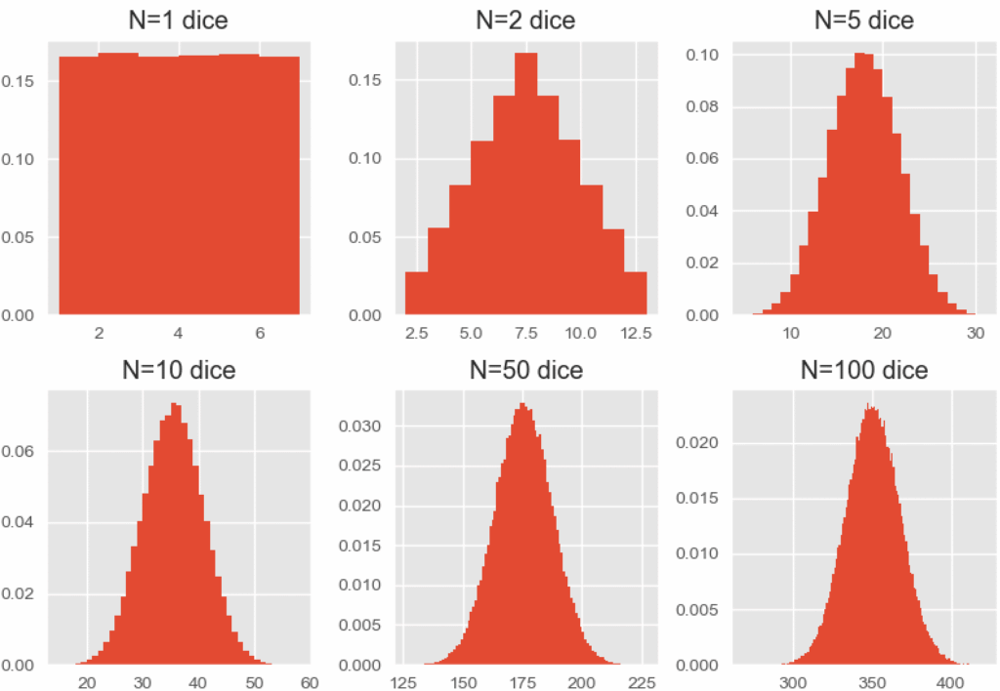
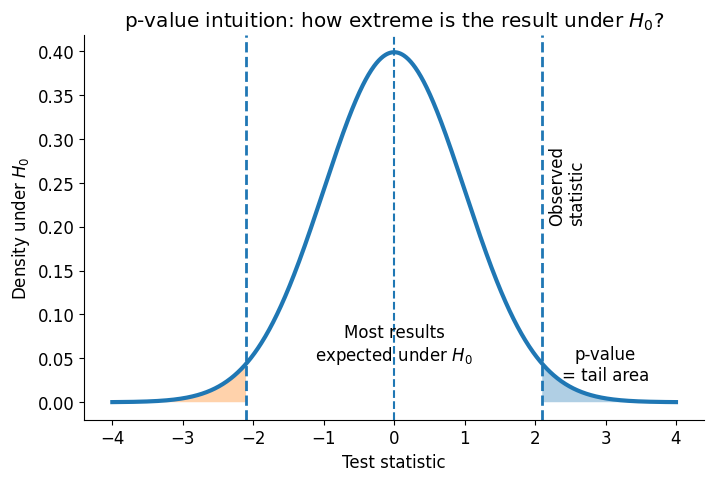
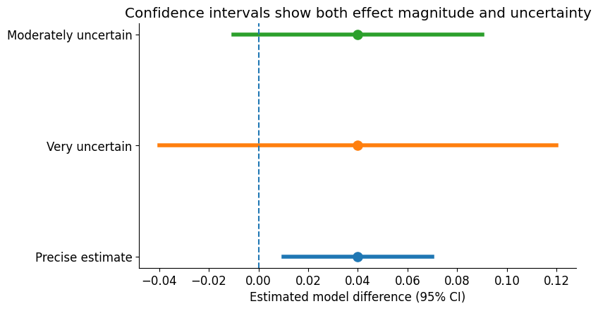
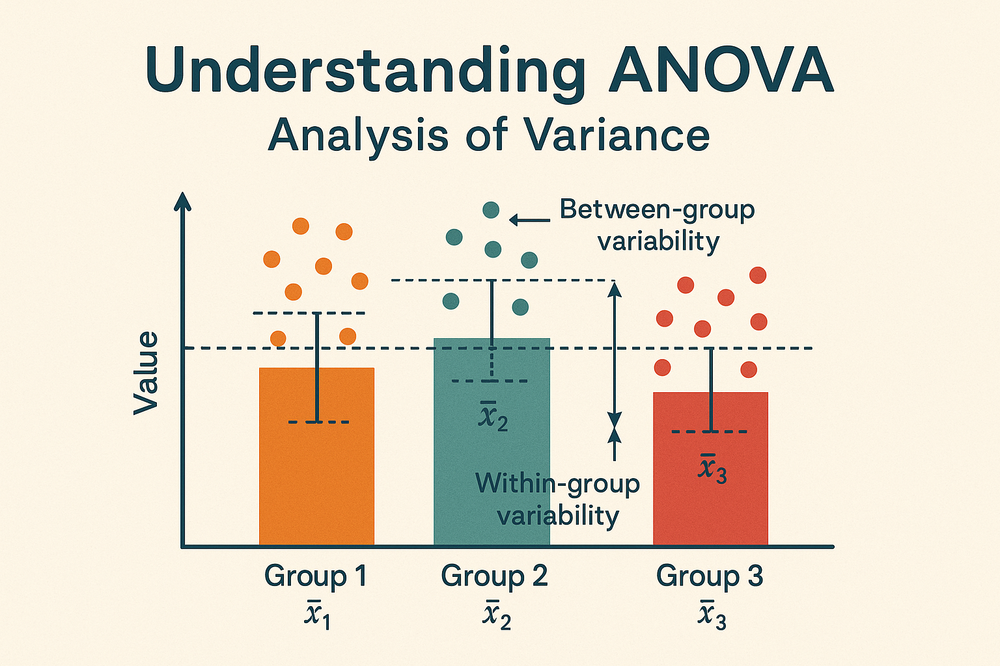

# Week 4 Review: PCA, Kernels, SVMs, and Statistical Evaluation
------------------------------------------------------------------------

## 1. The big picture

This week has a useful progression:

1.  **How should we represent our data?**\
    PCA and other transformations change the feature space so that useful structure may be easier to see or model.

2.  **How should we build a classifier in that space?**\
    SVMs find a separating boundary by focusing on the margin between classes. Kernels let an SVM represent nonlinear boundaries without explicitly constructing every transformed feature.

3.  **How should we evaluate the model?**\
    Train/test splits and cross-validation ask whether performance generalizes beyond the observations used to fit the model.

4.  **How do we know whether an observed performance difference is convincing?**\
    Statistical inference asks whether the difference we observed is large relative to the amount of variation we would expect from sampling, splitting, or fitting.

A useful mental model is:

> **Representation → model → evaluation → inference**

Each stage can affect the next one.

------------------------------------------------------------------------

# Part I --- Data Splitting and Cross-Validation

## 2. Why do we need data splitting?

A model can perform extremely well on data it has already seen and still perform poorly on new data.

The purpose of a test set is therefore not simply to produce an accuracy number. It is to simulate the real question we care about:

> **How well will this model perform on data that did not participate in fitting it?**

A single train/test split gives one answer to that question, but that answer depends partly on **which observations happened to land in each set**.

Imagine two students taking different versions of an exam. If one exam happened to be much easier, comparing their raw scores is not a perfect comparison of ability. Similarly, a model may look unusually good or bad because of the particular test set it received.

That is one reason we use **cross-validation**.

------------------------------------------------------------------------

## 3. K-fold cross-validation

In K-fold cross-validation:

-   divide the available data into (K) folds;
-   train on (K-1) folds;
-   validate on the remaining fold;
-   repeat until each fold has served as validation data;
-   examine performance across the folds.

Instead of asking:

> "What was my model's performance on this one split?"

we can ask:

> "How stable is my model's performance across several reasonable versions of the train/validation split?"

This gives us both a performance estimate **and information about variability**.

### Why not always use a huge K?

There is a tradeoff.

-   Smaller (K): each model has somewhat less training data, but there are fewer models to fit.
-   Larger (K): each model trains on more of the dataset, but computation increases and the validation sets become smaller.
-   Leave-one-out CV is the extreme case where (K=n).

The lecture gives common rule-of-thumb values around (K=5) to (10), but the important idea is that **K is a design choice, not a magic constant**.

------------------------------------------------------------------------

## 4. The split should match the scientific question

Random splitting is not automatically the correct splitting strategy.

### Stratified splitting

Use stratification when you want folds to preserve an important distribution, commonly the class balance.

This matters especially for imbalanced classification. A random split could accidentally produce a validation set containing very few examples of the minority class.

### Group-based splitting

Suppose every patient contributes 20 measurements.

If measurements from the same patient appear in both training and testing, the model may partially learn **who the patient is** rather than the biological phenomenon you care about.

If the real deployment question is:

> "Can this model work on a new patient?"

then the test set needs **new patients**, not merely new measurements from familiar patients.

This is why the lecture's Parkinson's voice example is important: splitting recordings rather than participants can produce an apparently excellent classifier because patient identity leaks across the split.

### Time-based splitting

If the real goal is predicting future observations, training on earlier data and testing on later data can better approximate deployment than randomly mixing observations from all time periods.

### Core principle

> **Your validation design defines what "generalization" means.**

------------------------------------------------------------------------

## 5. Data leakage: preprocessing is part of training

Anything that learns from the data must be fit using training data only.

That includes:

-   feature selection,
-   scaling parameters,
-   PCA,
-   imputation,
-   hyperparameter selection,
-   other transformations that estimate something from the dataset.

If you select features using all labels and *then* cross-validate only the classifier, information from the validation folds has already influenced the feature-selection step.

A correct CV pipeline repeats the entire learned pipeline inside each fold.

------------------------------------------------------------------------

# Part II --- PCA and Dimensionality Reduction

## 6. Why can many predictors become a problem?

More features are not automatically better.

As dimensionality increases:

-   the feature space becomes increasingly sparse;
-   meaningful notions of "near" and "far" can weaken;
-   accidental patterns become easier to fit;
-   a fixed number of observations must support estimation in a much larger space.

This is part of the **curse of dimensionality**.

Dimensionality reduction asks:

> **Can we represent most of the useful structure with fewer variables?**

------------------------------------------------------------------------

## 7. PCA: the intuition

Principal Component Analysis constructs new axes through the data.

The **first principal component (PC1)** is the direction along which the observations vary the most.

The **second principal component (PC2)** captures the greatest remaining variance subject to being orthogonal to PC1.

The process continues for later components.

So PCA is not asking:

> "Which direction best separates my classes?"

It is asking:

> **"Along which directions does the dataset vary most?"**

That distinction matters because PCA is **unsupervised**: it does not use the class labels.

A direction containing enormous variation may have nothing to do with the prediction target.

------------------------------------------------------------------------

## 8. Why center before PCA?

PCA is based on variation **around the mean**.

Mean-centering each feature gives

$$
x_{ij}^{\text{centered}} = x_{ij} - \bar{x}_j
$$

Now the origin represents the center of the dataset, and the covariance matrix describes how features vary together around that center.

For the by-hand PCA calculation in Lab 4, this is why centering comes before computing

\[ \frac{X^TX}{n-1}. \]

------------------------------------------------------------------------

## 9. Why scale before PCA?

PCA seeks directions with large variance.

That means a variable with a much larger numerical scale can dominate the principal components simply because its units produce larger variance.

Example:

-   Feature A ranges from 0--1.
-   Feature B ranges from 0--10,000.

Without scaling, Feature B can dominate the covariance structure even if that is not scientifically desirable.

Standardizing to standard deviation 1 says, approximately:

> "For this analysis, compare variation relative to each feature's own typical scale."

Whether scaling is appropriate is a scientific choice, but in the PBMC lab the motivation is that highly expressed genes tend to have larger count variance and we do not necessarily want them to dominate solely for that reason.

------------------------------------------------------------------------

## 10. PCA mathematically

For centered data matrix $X$:

$$
\text{Cov}(X) = \frac{X^T X}{n-1}.
$$

We eigendecompose the covariance matrix:

$$
Av = \lambda v.
$$

### Eigenvectors

The eigenvectors give the **directions of the principal components**.

### Eigenvalues

The corresponding eigenvalues tell us **how much variance lies along those directions**.

Therefore,

$$
\text{Explained variance ratio of PC}_j = \frac{\lambda_j}{\sum_k \lambda_k}.
$$

A large eigenvalue means that principal component captures a large amount of the dataset's variance.

---

## 11. PCA is a transformation before it is a reduction

If the original data have $p$ dimensions, PCA can produce up to

$$
\min(n-1,p)
$$

nonzero principal components after centering.

If we retain all of them, we have mainly **changed coordinates**.

Dimensionality reduction occurs when we intentionally keep only the first $q$ components, where $q < p$.

That creates a tradeoff:

> fewer dimensions ↔ less retained variance

The lab's elbow and cumulative explained-variance plots are tools for reasoning about that tradeoff.

### Important warning

**Variance is being used as a surrogate for information.**

High variance is not synonymous with "important for my prediction problem."

------------------------------------------------------------------------

## 12. PCA versus LDA
A useful contrast:

| **PCA** | **LDA** |
|---|---|
| Unsupervised | Supervised |
| Does not use class labels | Uses class labels |
| Maximizes variance | Maximizes class separation |
| Finds directions describing the dataset | Finds directions useful for distinguishing classes |

So a PCA plot may fail to visibly separate classes even when those classes are predictable from the data.

------------------------------------------------------------------------

# Part III --- Kernels and SVMs

## 13. SVM intuition: don't just separate --- create a margin

Suppose many different lines perfectly separate two classes.

Which line should we choose?

A support vector machine chooses a boundary that **maximizes the margin** between the classes.

The observations closest to the boundary determine that margin. These are the **support vectors**.

A useful intuition is:

> Most training points do not determine the exact location of the final boundary. The difficult boundary cases do.

------------------------------------------------------------------------

## 14. Hard margin versus soft margin

Real biomedical data are noisy and often cannot be perfectly separated.

A hard-margin classifier requires perfect separation.

A **soft-margin SVM** allows some observations to enter the margin or be misclassified using slack variables.

This introduces a tradeoff:

-   tolerate violations to obtain a simpler/wider margin;
-   penalize violations more strongly to fit the training data more closely.

This is conceptually similar to other regularization tradeoffs: **fit versus complexity/generalization**.

------------------------------------------------------------------------

# Part III — Kernels and SVMs

## 15. Why kernels?

A straight line cannot separate every pattern.

But a pattern that is nonlinear in the original feature space may become linearly separable after transforming the features.

For example, adding features such as

$$
x_1^2,\quad x_2^2,\quad x_1x_2
$$

can make a curved relationship linearly separable in the transformed space.

---

## 16. The kernel trick

A kernel computes an inner product in an implicit transformed feature space:

$$
K(x_i,x_j) = \langle \phi(x_i), \phi(x_j) \rangle.
$$

The key idea is:

> **We can calculate the similarity that two observations would have after transformation without explicitly calculating all transformed coordinates.**

For the degree-2 polynomial example in Lab 4,

$$
K(x,y) = (x \cdot y + 1)^2.
$$

The lab has you explicitly construct $\phi(x)$ once so that you can see why the shortcut works.


------------------------------------------------------------------------

## 17. Linear, polynomial, and RBF kernels

### Linear kernel

Useful when a roughly linear boundary is sufficient.

### Polynomial kernel

Allows interactions and polynomial-shaped relationships.

### RBF kernel

Creates flexible, localized nonlinear decision boundaries based on similarity.

There is no universally "best" kernel. The question is empirical:

> **Which representation of similarity produces a model that generalizes best for this dataset?**

That is why Lab 4 compares linear, polynomial, and RBF SVMs with 10-fold cross-validation.

------------------------------------------------------------------------

# Part IV --- Statistical Thinking: What Are We Actually Trying to Learn?

## 18. Why statistics enters model evaluation

Suppose your 10-fold CV accuracy is:

-   Model A: 0.88
-   Model B: 0.86

Is Model A genuinely better?

You do **not** yet know.

Why? Because observed performance varies.

Variation can come from:

-   which observations are in each fold;
-   which dataset is used;
-   randomness in model fitting;
-   sampling variability;
-   measurement noise.

The observed difference can therefore be thought of as:

$$
\text{observed difference} = \text{underlying difference} + \text{random variation}.
$$


Statistical inference helps us reason about whether the observed signal is large relative to the noise.

------------------------------------------------------------------------

# Part V --- Sampling Distributions and the Central Limit Theorem

## 19. Population, sample, statistic

Suppose we care about the mean performance a model would achieve across the broader population of relevant datasets or samples.

That population quantity is a **parameter**.

We cannot usually observe the entire population, so we collect a **sample** and calculate a statistic, such as the sample mean.

If we repeated the experiment with a new random sample, we would probably get a slightly different sample mean.

That variability is the foundation of statistical inference.

------------------------------------------------------------------------

## 20. The sampling distribution thought experiment

Imagine doing the following:

1.  Draw 100 observations.
2.  Calculate their mean.
3.  Throw them away.
4.  Draw another 100 observations.
5.  Calculate another mean.
6.  Repeat thousands of times.

You now have a distribution of **sample means**.

That is a **sampling distribution**.

Notice the distinction:

-   the **data distribution** describes individual observations;
-   the **sampling distribution of the mean** describes how an estimated mean changes from sample to sample.

This distinction is essential for understanding the CLT, standard errors, confidence intervals, and hypothesis tests.

------------------------------------------------------------------------

## 21. What does the Central Limit Theorem tell us?

Very roughly, under appropriate conditions, as the sample size becomes sufficiently large, the sampling distribution of the sample mean becomes approximately normal even when the underlying observations themselves are not normally distributed.

Symbolically,

$$
\bar{X} \approx N\left(\mu, \frac{\sigma^2}{n}\right).
$$

The important part is not merely "things become normal."

The important part is:

> **The CLT gives us a predictable probability model for how sample means fluctuate around the population mean.**

That is what makes many inferential calculations possible.

------------------------------------------------------------------------

## 22. What does the CLT allow us to do?

Once we have a model for the sampling distribution, we can reason about
questions such as:

-   How surprising is this estimated mean if a proposed population mean were true?
-   How much would we expect our estimate to change if we repeated the study?
-   What range of population values is reasonably compatible with our data?

These lead to:

-   standard errors,
-   confidence intervals,
-   hypothesis tests,
-   p-values.

The CLT is therefore a bridge:

> **sample → sampling distribution → uncertainty about the population**

------------------------------------------------------------------------

## 23. Why does sample size matter?

The standard deviation of the sampling distribution of a mean is the **standard error**:

$$
SE(\bar{X})=\frac{\sigma}{\sqrt{n}}.
$$

As $n$ increases, the standard error decreases.

### Intuition: averaging cancels out some noise

Imagine repeatedly taking samples from the same population:

<p align="center">

  

</p>
An individual observation may be noisy, but averaging many independent observations stabilizes the estimate.

The standard error shrinks like $1/\sqrt{n}$:

- multiplying $n$ by 4 cuts the standard error in half;
- multiplying $n$ by 100 cuts it by a factor of 10.

So more data gives greater precision, but with **diminishing returns**.

### A useful mental model

$$
\text{more observations}
\quad\Longrightarrow\quad
\text{less sampling variability}
\quad\Longrightarrow\quad
\text{more precise estimates}
$$

This is about the **estimate**, not necessarily about making the underlying observations less noisy.

---

# Part VI — Hypothesis Testing Without the Cookbook

## 24. What is a null hypothesis?

A statistical test begins by specifying a **null hypothesis**, $H_0$.

Usually, $H_0$ represents a particular "no difference" or "no association" model.

For example:

$$
H_0:\mu_A-\mu_B=0.
$$

Or, for paired model-performance measurements:

$$
H_0:\mu_d=0,
$$

where

$$
d_i=A_i-B_i.
$$

The null hypothesis is not automatically what we believe. It is the reference model against which we compare the observed data.

### The logic of a hypothesis test

```text
Start with a null model
        │
        ▼
What results would be typical if that null model were true?
        │
        ▼
Compare our observed result to those expected results
        │
        ▼
Is our result unusually far from what the null predicts?
```

That last question is the heart of hypothesis testing.

---

## 25. What is a test statistic?

A **test statistic** compresses the relevant evidence in the data into a number.

A useful general intuition is:

$$
\text{test statistic}
\approx
\frac{\text{observed effect}-\text{null effect}}
{\text{expected variability}}.
$$

For a t-test:

$$
t = \frac{\text{observed difference}} {\text{standard error of the difference}}.
$$

This explains why a difference cannot be interpreted by itself.

Consider two experiments:

```text
Experiment A

Difference:   0.02
Noise:        0.001

0.02 / 0.001 = 20
                    ↑
              very large relative to expected variation


Experiment B

Difference:   0.02
Noise:        0.10

0.02 / 0.10 = 0.2
                ↑
          small relative to expected variation
```

The effect size is identical, but the evidence is not.

### Core intuition

> **Statistical tests ask whether the effect is large relative to the noise.**

---

## 26. What does a p-value mean?

The cleanest intuition is:

> **Assume the null hypothesis is true. How surprising would a result at least this incompatible with the null be?**

Formally,

$$
p
=
P(\text{test statistic at least as extreme as observed}\mid H_0).
$$

### Visual intuition

Imagine that the null hypothesis says the true difference is zero. Repeated experiments under that null would generate a distribution of possible test statistics:

<p align="center">

  

</p>

For a two-sided test, we consider results at least as extreme in **either direction**.

### Example

Suppose $p=0.03$.

A useful interpretation is:

> If the null model were true, results at least this extreme would occur about 3% of the time under repeated experiments generated according to that null model. i.e. P(results at least as extreme as our results | H0 is true) = p-value

### A p-value is **not**

$$
P(H_0\mid\text{data}).
$$

So $p=0.03$ does **not** mean:

- "There is a 3% probability that the null hypothesis is true."
- "There is a 97% probability that my hypothesis is true."
- "There is a 97% probability that the result will replicate."
- "The difference is large."
- "The difference is scientifically important."

The p-value describes the compatibility of the observed result with a specified null model. It does not directly give the probability that the hypothesis itself is true.

---

## 27. Why small p-values happen

A small p-value can result from:

1. a large effect;
2. low variability;
3. a large sample size;
4. some combination of these.

This is easiest to see from the basic structure:

$$
\text{signal-to-noise}
=
\frac{\text{effect size}}{\text{uncertainty}}.
$$

A very small effect can still produce a very small p-value when the uncertainty is tiny.


---

## 28. The 0.05 threshold is not a cliff

Compare:

- $p=0.049$
- $p=0.051$

These results are extremely similar in terms of what the data say.

It is poor statistical reasoning to treat one as a discovery and the other as having no evidence whatsoever.

A threshold is a decision convention. The p-value itself is continuous information about compatibility with the null model.

Think of it more like a **dimmer switch than a light switch**:

```text
p-value

0.001   ████████████████████
0.01    ███████████████
0.05    ████████
0.10    ████
0.50    █
        └────────────────────────→
          increasingly compatible
          with the null model
```

---

# Part VII — Confidence Intervals

## 29. What does a confidence interval add?

A hypothesis test often focuses attention on:

> "Is zero plausible under this testing procedure?"

A confidence interval gives more information:

> **What range of effect sizes is compatible with the data under the interval procedure?**

For example:

$$
\widehat{\Delta}=0.04
\qquad
95\%\,CI=[0.01,\,0.07].
$$

Now we can see:

- the estimated effect is about $0.04$;
- the interval does not include zero;
- the interval gives us a sense of the uncertainty around the estimate;
- values near $0.01$ and $0.07$ are both much more compatible with the data than values far outside the interval.

### Visual intuition

<p align="center">

  

</p>

A confidence interval is useful because it communicates **magnitude and uncertainty**, not merely whether a threshold was crossed.

### Frequentist 95% CI intuition

The formal repeated-sampling interpretation is:

> If we repeatedly sampled data and constructed intervals using this same procedure, about 95% of those intervals would contain the true parameter.

It is **not**, in the usual frequentist interpretation, a statement that there is a 95% probability that the already-fixed parameter lies inside this particular interval.

**Note about Confidence Intervals**

We generally **should not determine whether two means are significantly different by checking whether their individual 95% confidence intervals overlap**. Those intervals describe the uncertainty around each mean separately, rather than the uncertainty around the quantity we actually want to compare: the **difference between the means**.

Instead, construct a 95% confidence interval for

$$
\mu_1 - \mu_2.
$$

The key question is whether **0 is a plausible value for the difference**:

- **If the 95% CI excludes 0:** there is evidence of a statistically significant difference between the means at the corresponding two-sided $\alpha=0.05$ significance level.
- **If the 95% CI includes 0:** we do not have sufficient evidence to conclude that the means differ at the $\alpha=0.05$ level.

Importantly, a confidence interval containing 0 does **not** prove that the two population means are equal. It means that **no difference ($\mu_1-\mu_2=0$) is still compatible with the data and uncertainty in our estimate**.

> **Key intuition:** If our question is about a *difference*, we want to quantify the uncertainty around the **difference itself**, not compare the uncertainty intervals around two quantities separately.
---

# Part VIII — Choosing a Statistical Test by Asking Questions

## 30. Don't start with the test name

Instead of asking:

> "Should I use a t-test or Wilcoxon?"

start with the design of the experiment.

### Question 1: What quantity am I comparing?

- Means?
- Ranks or distributions?
- Paired differences?
- Correct/incorrect predictions?
- More than two groups?

### Question 2: Are the observations paired?

This is one of the most important questions.

If Model A and Model B are evaluated on the **same fold**, those two scores share the same validation data.

They are naturally paired.

The useful quantity is often the within-fold difference:

$$
d_i=A_i-B_i.
$$

### Why pairing helps

Suppose some folds are easy and others are hard.

```text
             Fold 1   Fold 2   Fold 3   Fold 4
             ──────   ──────   ──────   ──────

Model A        .92      .70      .95      .80
Model B        .90      .68      .93      .79
                │        │        │        │
difference     +.02     +.02     +.02     +.01
```

The absolute performance changes a lot across folds, but the **A-minus-B difference is very consistent**.

Pairing lets us focus on the comparison we actually care about.

### Question 3: What assumptions am I willing to make?

For example:

- approximate normality?
- equal variances?
- independence?
- appropriate pairing?
- sufficient sample size for an approximation?

Only after answering these questions should you choose the test.

---

# Part IX — Intuition for the Tests in Lecture 11

## 31. Two-sample t-test

### Question

> Do two **independent** groups have different population means?

Null hypothesis:

$$
H_0:\mu_1=\mu_2.
$$

The test compares the observed difference in sample means with the amount of difference expected from sampling variability.

### Think of it as

```text
Observed difference
        │
        ▼
How big is it?
        │
        ▼
How much difference would we expect from random sampling?
        │
        ▼
Is the observed difference large relative to that noise?
```

### Classical assumptions

The lecture gives:

- independent observations;
- normality within groups;
- equal variances.

**Welch's t-test** does not require equal variances because it estimates the uncertainty from each group separately.

---

## 32. Paired t-test

### Question

> Is the mean within-pair difference different from zero?

Instead of treating

$$
A_1,A_2,\ldots,A_n
$$

and

$$
B_1,B_2,\ldots,B_n
$$

as unrelated groups, calculate

$$
d_i=A_i-B_i
$$

and test whether

$$
\mu_d=0.
$$

### Visual intuition

```text
Same fold / dataset

          A          B
Fold 1   0.92       0.90     → d₁ = +0.02
Fold 2   0.70       0.68     → d₂ = +0.02
Fold 3   0.95       0.93     → d₃ = +0.02
Fold 4   0.80       0.79     → d₄ = +0.01

                         ↓

               Analyze the d's
              +.02, +.02, +.02, +.01
```

The paired test is asking:

> **Across the same challenges, is there a systematic advantage for one model?**

---

## 33. Wilcoxon signed-rank test

### Question

> For paired observations, is there evidence of a systematic nonzero difference without relying on the paired t-test's normality assumption?

The test works with the **ranks of the paired differences**, together with their signs.

A useful intuition is:

```text
Paired differences

large +     + + + + +       ← many positive differences
small +       + +           ←
small -             -       ←
large -                 --  ←

              rank
              ↓
      How systematically do the differences lean in one direction?
```

The test is therefore less focused on the exact numerical size of each difference than the t-test.

"Nonparametric" does **not** mean "assumption free." The test still depends on appropriate pairing and assumptions about the distribution of the paired differences.

---

## 34. Mann–Whitney U test

This is an **unpaired** rank-based alternative for comparing two independent groups.

A useful intuition is:

> Put observations from both groups into one ordered list and ask whether one group tends to appear higher in the ranking.

```text
Low ─────────────────────────────────────────── High

Group A:   A   A      A   A
Group B:       B  B       B   B

If the two groups are well separated, one group's observations tend to occupy higher ranks than the other's.
```

It is often described casually as a test of medians, but that is not generally the safest interpretation.

More broadly, it tests whether observations from one group tend to rank above or below observations from the other.

---

## 35. McNemar test

McNemar's test answers a different question.

Suppose two classifiers make predictions on the **same test observations**.

Each observation falls into one of four categories:

| | Model B correct | Model B wrong |
|---|---:|---:|
| **Model A correct** | both correct | A only correct |
| **Model A wrong** | B only correct | both wrong |

The informative cases are the **disagreements**:

- A correct, B wrong
- A wrong, B correct

The null hypothesis asks whether those two types of disagreement occur at the same rate.

### Why accuracy alone is insufficient

Two classifiers can both have 90% accuracy while making very different mistakes. McNemar uses that paired prediction information.

> **McNemar does not simply compare two accuracy numbers. It compares the disagreement pattern between two classifiers on the same observations.**

---

## 36. ANOVA

### Question

> Are all group population means equal, or is there evidence that at least one differs?

ANOVA is useful for comparing more than two groups simultaneously.

### Intuition: between-group variation vs. within-group variation

Imagine three groups:

<p align="center">

  

</p>
ANOVA essentially asks whether the variation **between group means** is large compared with the variation **within groups**.

Very roughly:

$$
F
\sim
\frac{\text{between-group variation}}
{\text{within-group variation}}.
$$

A large ratio is evidence that the group means are not all equal.

The classical one-way ANOVA assumes:

- independence;
- approximate normality;
- equal variances.

For nonparametric alternatives, the lecture mentions:

- **Kruskal–Wallis** for independent groups;
- **Friedman** for paired/repeated groups.

---

# Part X — Multiple Comparisons

## 37. The "multiple shots on goal" problem

Suppose every test uses $\alpha=0.05$.

If you perform one null test, a false positive is relatively uncommon.

If you perform many tests, however, you have many opportunities to obtain a small p-value just by chance.

For 20 independent tests:

$$
P(\text{at least one false positive}) = 1-(1-0.05)^{20} \approx 0.64.
$$

So even if every null hypothesis is actually true, there would be about a 64% chance of seeing at least one $p<0.05$ result across 20 independent tests.

### Visual intuition

```text
One test:

[  chance of a false positive  ]
                ↓
              5%


Many tests:

[ ][ ][ ][ ][ ][ ][ ][ ][ ][ ][ ][ ][ ][ ][ ][ ][ ][ ][ ][ ]

                     ↑
             many opportunities to get a "lucky" result
```

This is why multiple-comparison correction exists.

---

## 38. Bonferroni correction

One simple approach is:

$$
\alpha_{\text{adjusted}} = \frac{\alpha}{m},
$$

where $m$ is the number of tests.

Equivalently, adjusted p-values can be calculated as

$$
p_{\text{adjusted}} = \min(mp,1).
$$

Bonferroni is simple and conservative.

The deeper lesson is not:

> "Always use Bonferroni."

It is:

> **The meaning of a surprising result depends partly on how many opportunities you gave yourself to find one.**

---

# Part XI — Statistical Significance Is Not the Finish Line

## 39. A good analysis asks several different questions

Suppose Model A has a statistically significant improvement over Model B.

You should still ask:

### Is the effect large?

A difference of 0.001 accuracy may be detectable with enough data but irrelevant in practice.

### Is the estimate precise?

Look at variability, standard errors, or confidence intervals.

### Is the evaluation realistic?

A tiny p-value cannot rescue a leaked or inappropriate train/test split.

### Is the result robust?

Does the conclusion persist across reasonable splits, datasets, or model seeds?

### Is the metric appropriate?

Accuracy can hide poor performance on an important minority class.

### Is the result scientifically meaningful?

Statistical significance is not the same thing as clinical or practical importance.

---

# Part XII — Connecting Statistics Back to Lab 4

## 40. What the 10-fold SVM experiment is really doing

In Lab 4 you compare linear, polynomial, and RBF SVMs using 10-fold cross-validation and report accuracy and recall with SEM error bars.

Do not think of this as merely:

> "Run three models and pick the tallest bar."

Instead:

```text
Choose a kernel
      │
      ▼
Fit on training folds
      │
      ▼
Evaluate on held-out fold
      │
      ▼
Repeat across folds
      │
      ▼
Obtain a distribution of
performance measurements
      │
      ▼
Ask about BOTH:
  • typical performance
  • variability / uncertainty
      │
      ▼
Compare models statistically
```

Each kernel encodes a different notion of geometry or similarity.

Each fold gives a new evaluation of the model on held-out observations.

The fold scores tell us both about **typical performance** and about **variation across evaluations**.

---

## 41. Accuracy, precision, and recall

For binary classification:

$$
\text{Accuracy} = \frac{TP+TN}{TP+TN+FP+FN}
$$

$$
\text{Precision} = \frac{TP}{TP+FP}
$$

$$
\text{Recall} = \frac{TP}{TP+FN}.
$$

### Intuition

**Precision asks:**

> Of the observations I called positive, how many really were positive?

**Recall asks:**

> Of all the truly positive observations, how many did I find?

### Why accuracy is not enough

Suppose only 1% of patients have a condition.

A classifier that predicts "negative" for everyone gets:

$$
99\% \text{ accuracy}
$$

while detecting:

$$
0\% \text{ of positive cases}.
$$

The appropriate metric depends on which errors matter.

---

# Part XIII — A Statistical Test Decision Map

## 42. Start from the experimental design

| Scientific question | Data structure | Typical test |
|---|---|---|
| Is one mean different from a reference? | One sample | One-sample t-test |
| Do two independent groups differ in mean? | Independent groups | Two-sample t-test / Welch's t-test |
| Do two independent groups tend to differ without a normal model? | Independent groups | Mann–Whitney U |
| Do two models differ on the same datasets/folds? | Paired scores | Paired t-test |
| Same paired question without normality assumption | Paired scores | Wilcoxon signed-rank |
| Do two classifiers make different errors on the same test observations? | Paired categorical outcomes | McNemar |
| Do more than two independent groups have equal means? | Independent groups | One-way ANOVA |
| Do more than two independent groups differ without parametric assumptions? | Independent groups | Kruskal–Wallis |
| Do more than two models differ across the same datasets? | Repeated/paired | Repeated-measures ANOVA / Friedman |

### The decision tree

```text
What are you comparing?
        │
        ├── One group vs. a reference
        │        └── One-sample test
        │
        ├── Two groups
        │      │
        │      ├── Same observations / matched pairs?
        │      │        ├── Yes → paired t / Wilcoxon
        │      │        └── No  → two-sample t / Welch / Mann–Whitney
        │      │
        │      └── Predictions on the same observations?
        │               └── McNemar
        │
        └── More than two groups
               │
               ├── Independent → ANOVA / Kruskal–Wallis
               └── Paired      → repeated-measures ANOVA / Friedman
```

The point is not to memorize this table by itself.

For every test, be able to explain:

> **What question does this test answer, and why does the structure of
> my data make it appropriate?**

---

# Part XIV — Common Misconceptions to Catch

## 43. True or false?

### "A p-value is the probability that the null hypothesis is true."

**False.**

It is calculated under the assumption that the null hypothesis is true.

### "If $p>0.05$, the null hypothesis has been proven."

**False.**

Failure to reject is not proof of equality.

### "If $p<0.05$, the effect must be important."

**False.**

Statistical detectability does not tell you whether the effect is
practically important.

### "Nonparametric tests have no assumptions."

**False.**

They generally make fewer or different assumptions, not zero assumptions.

### "A paired test is just a more powerful version of an unpaired test."

**False.**

Pairing reflects the experimental design. Use it when observations are
meaningfully matched.

### "Cross-validation eliminates overfitting."

**False.**

Cross-validation helps estimate generalization and tune models. It does
not make overfitting impossible.

### "Anything can be done before CV as long as the classifier itself is trained inside the folds."

**False.**

Any learned preprocessing that uses information from the full dataset can
leak information from the validation folds.

### "PCA finds the features most useful for classification."

**False.**

PCA finds directions of maximal variance without using class labels.

### "A kernel explicitly maps every observation into the higher-dimensional feature space."

**False.**

The kernel trick can compute the relevant inner product without explicitly
constructing all transformed coordinates.

---

# Part XV — Questions to Work Through in Recitation

## 44. Conceptual discussion prompts

### Prompt 1 — What does the p-value change?

Two experiments both estimate that Model A beats Model B by 2 percentage
points.

- Experiment 1: differences across repetitions are extremely stable.
- Experiment 2: differences vary wildly from repetition to repetition.

**Question:** Which experiment provides stronger evidence that the models
differ? Why?

**Key idea:** same effect size, different uncertainty.

---

### Prompt 2 — Sample size

Study A finds a mean difference of 5 with $n=20$.

Study B finds the same mean difference of 5 with $n=2{,}000$, with similar
observation-level variance.

**Question:** How should the standard errors compare?

**Key idea:**

$$
SE\propto\frac{1}{\sqrt{n}}.
$$

---

### Prompt 3 — Statistical versus practical significance

A new classifier improves accuracy from 90.000% to 90.005% with
$p<10^{-6}$.

**Questions:**

What does the p-value tell you?

What does it **not** tell you?

What additional questions should you ask before deciding whether the new
model is useful?

---

### Prompt 4 — Paired or unpaired?

You evaluate SVM-A and SVM-B on the same 10 CV folds.

**Question:** Why are the 20 accuracy values not best thought of as two
unrelated groups?

**Key idea:** each A score has a natural B counterpart produced on the
same validation fold.

---

### Prompt 5 — McNemar

Two classifiers both achieve 90% accuracy on the same 1,000 observations.

**Question:** Could their predictions still be very different?

Yes.

What information does McNemar use that the two accuracy numbers discard?

---

### Prompt 6 — PCA

PC1 explains the most variance in a gene-expression dataset but shows no
separation between disease classes.

**Question:** Does this mean the dataset contains no disease signal?

**No.**

PCA optimizes variance, not class separation.

---

### Prompt 7 — Leakage

You standardize all observations, run PCA on the entire dataset, keep 20
PCs, and then perform 10-fold CV on an SVM.

**Question:** What is wrong?

The validation observations influenced the learned PCA transformation.

The appropriate approach is to fit the preprocessing and PCA using only
the training portion of each fold, then apply that fitted transformation
to the validation portion.

---

# Part XVI — A Better Workflow for Statistical Analysis

## 45. Before running a test, say these sentences

A strong statistical analysis can often begin with five statements:

1. **My scientific question is:**  
   "Do these models differ in performance?"

2. **My observational unit is:**  
   "One performance measurement per model per dataset/fold," or "one
   prediction per patient."

3. **My data are paired/unpaired because:**  
   "Both models were evaluated on the same folds."

4. **My null hypothesis is:**  
   "The population mean paired difference is zero."

5. **This test is appropriate because:**  
   "The test targets paired differences and its assumptions are
   reasonable for these data."

If you cannot clearly fill these in, running

```python
scipy.stats.whatever(...)
```

is premature.

---

# Part XVII — What to Remember

## 46. The big ideas

### Data splitting

> **Evaluation should mimic the kind of unseen data you ultimately care
> about.**

### Cross-validation

> **Repeated splits let us see how much our evaluation changes across
> different train/validation partitions.**

### PCA

> **Find directions of maximal variance; reduce dimensions by retaining
> only some of those directions.**

### LDA

> **Use the class labels to find directions that emphasize class
> separation.**

### Distance metrics

> **A distance metric is a definition of similarity. Changing the metric
> can change the neighbors and therefore change a KNN prediction.**

### SVM

> **Choose a separating boundary with a large margin; support vectors are
> the observations closest to the boundary that constrain that solution.**

### Kernel trick

> **Compute similarity as though the data were transformed into another
> feature space without explicitly constructing every transformed
> feature.**

### Central Limit Theorem

> **Under appropriate conditions, the sampling distribution of a sample
> mean becomes approximately normal as the sample size grows.**

### Standard error

> **How much would an estimate tend to move around across repeated
> samples?**

### Hypothesis test

> **Is the observed effect large relative to the variation expected under
> a null model?**

### p-value

> **If the null model were true, how unusual would evidence at least this
> incompatible with it be?**

### Confidence interval

> **What range of effect sizes is compatible with the data under the
> interval procedure?**

### Statistical significance

> **Evidence about compatibility with a null model — not a measure of
> effect size, importance, or truth.**

### Choosing a test

> **Start with the scientific question and experimental design, not the
> name of a statistical test.**
